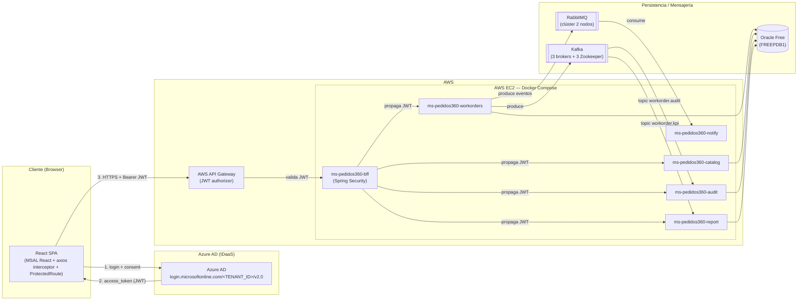

# Pedidos360 — Plataforma de Órdenes de Trabajo de Mantención Eléctrica

Plataforma **cloud-native** para la gestión de órdenes de trabajo de mantención eléctrica.
Autenticación federada con **Azure AD (MSAL)**, backend de **microservicios Java/Spring Boot**,
mensajería asíncrona con **RabbitMQ** y streaming/analítica con **Kafka**, todo desplegado en
**AWS EC2** con **Docker Compose**.

---

## 1. Arquitectura



---

## 2. Mapa de repositorios

Entrega sugerida como **multi-repositorio** (o carpetas dentro de este monorepo). Cada
carpeta `backend/...` es un proyecto Maven independiente y autónomo (con su propio `pom.xml`,
`Dockerfile` y `.gitignore`).

| Repositorio GitHub | Ruta en este repo | Contenido |
|---|---|---|
| `pedidos360-frontend` | `frontend/pedidos360-react/` | React.js 18 + MSAL (config, ProtectedRoute, interceptor axios) |
| `ms-pedidos360-bff` | `backend/ms-pedidos360-bff/` | API Gateway interno / BFF + Spring Security |
| `ms-pedidos360-workorders` | `backend/ms-pedidos360-workorders/` | Dominio órdenes (CRUD) + **productor** RabbitMQ/Kafka |
| `ms-pedidos360-catalog` | `backend/ms-pedidos360-catalog/` | Catálogo de servicios y repuestos (Oracle) |
| `ms-pedidos360-notify` | `backend/ms-pedidos360-notify/` | **Consumidor** RabbitMQ (emails/push, sin BD) |
| `ms-pedidos360-audit` | `backend/ms-pedidos360-audit/` | **Consumidor** Kafka — timeline de auditoría (solo lectura) |
| `ms-pedidos360-report` | `backend/ms-pedidos360-report/` | **Consumidor** Kafka — KPIs (solo lectura) |
| `pedidos360-infra` | `infrastructure/` + `README.md` + `.env.example` | Docker Compose, topología de mensajería y documentación |

> **Nota sobre los `build.context`:** el archivo `infrastructure/compose.apps.yml` usa rutas
> relativas `../backend/...` y `../frontend/...` que asumen la estructura de **monorepo**.
> Si entregas repositorios separados, clónalos como carpetas hermanas o reemplaza `build` por
> `image: <registro>/ms-...:latest` tras publicar las imágenes en un registro de contenedores.

---

## 3. Tecnologías

| Capa | Tecnología |
|---|---|
| Frontend | React.js 18 · `@azure/msal-react` v2 · `@azure/msal-browser` v3 · axios |
| Backend | Java 21 · Spring Boot 3.3 · Spring Security · Spring Data JPA |
| Seguridad | OAuth 2.0 / OpenID Connect — Azure AD v2.0 · JWT (issuer, audience, firma, vigencia) |
| API Gateway | AWS API Gateway (JWT authorizer) |
| BD | Oracle (Oracle Free 23c / `ojdbc11`) |
| Mensajería | RabbitMQ 3.13 (clúster 2 nodos) — correo/push |
| Streaming | Apache Kafka 7.6 (3 brokers + 3 Zookeeper) — auditoría/KPIs |
| Despliegue | AWS EC2 · Docker · Docker Compose |

---

## 4. Microservicios y puertos

| Servicio | Puerto | BD | Responsabilidad |
|---|---|---|---|
| `pedidos360-react` | 3000 | — | SPA React (servida por nginx) |
| `ms-pedidos360-bff` | 8080 | — | Backend For Frontend + seguridad |
| `ms-pedidos360-workorders` | 8081 | Oracle | CRUD órdenes + productor de eventos |
| `ms-pedidos360-catalog` | 8082 | Oracle | CRUD servicios y repuestos |
| `ms-pedidos360-notify` | 8083 | — | Consumidor RabbitMQ (email/push) |
| `ms-pedidos360-audit` | 8084 | Oracle | Consumidor Kafka (timeline, solo lectura) |
| `ms-pedidos360-report` | 8085 | Oracle | Consumidor Kafka (KPIs, solo lectura) |

---

## 5. Topología de mensajería

### 5.1 RabbitMQ (3 colas + DLQ + bindings)

Ownership: el **consumidor** (`ms-pedidos360-notify`) declara sus colas; el **productor**
(`ms-pedidos360-workorders`) declara el exchange y publica. El `TopicExchange` permite enrutar
por clave.

| Exchange (topic) | Routing key | Cola principal | Dead Letter Exchange | DLQ |
|---|---|---|---|---|
| `pedidos360.workorder.exchange` | `workorder.created` | `workorder.created.queue` | `pedidos360.workorder.dlx` | `workorder.created.queue.dlq` |
| `pedidos360.workorder.exchange` | `workorder.status.#` | `workorder.status.queue` | `pedidos360.workorder.dlx` | `workorder.status.queue.dlq` |
| `pedidos360.workorder.exchange` | `workorder.completed` | `workorder.completed.queue` | `pedidos360.workorder.dlx` | `workorder.completed.queue.dlq` |

- Las colas principales tienen `x-dead-letter-exchange = pedidos360.workorder.dlx` y un
  `x-dead-letter-routing-key` propio.
- `spring.rabbitmq.listener.simple.default-requeue-rejected=false` + reintentos (`max-attempts: 3`):
  si el procesamiento falla tras los reintentos, el mensaje se rechaza y se enruta a su DLQ.
- La topología completa está en `ms-pedidos360-notify/src/main/java/com/pedidos360/notify/config/RabbitMQConfig.java`.

### 5.2 Kafka (tópicos)

Configurados en `ms-pedidos360-workorders/src/main/java/com/pedidos360/workorders/config/KafkaConfig.java`
(vía `NewTopic`), con 3 particiones y factor de replicación 3 (acorde a los 3 brokers).

| Tópico | Particiones | Replicas | Consumidor (group-id) |
|---|---|---|---|
| `workorder.audit` | 3 | 3 | `ms-pedidos360-audit` |
| `workorder.kpi` | 3 | 3 | `ms-pedidos360-report` |

- Productor: `JsonSerializer` con `spring.json.add.type.headers=false`.
- Consumidores: `JsonDeserializer` con `spring.json.use.type.headers=false` y
  `spring.json.value.default.type` (contrato desacoplado, cada servicio usa su propio DTO).
- Manejo de errores con `DefaultErrorHandler` (reintentos + log, sin bucle infinito).

---

## 6. Flujo de seguridad JWT (para la presentación)

1. **Login (interactivo)**: el usuario entra al SPA React. `ProtectedRoute` (MSAL React) detecta que no hay
   sesión y redirige a Azure AD (`authority = https://login.microsoftonline.com/<TENANT_ID>`).
2. **Consent**: Azure AD autentica al usuario y emite un `access_token` (JWT) para el
   `clientId` de la SPA y con el scope `api://<API_CLIENT_ID>/access_as_user`.
3. **Peticiones protegidas**: el interceptor de axios (`httpClient`) adjunta
   `Authorization: Bearer <access_token>` a cada llamada. Los roles (`roles`) y scopes (`scp`)
   se leen de los claims del JWT y los valida `ProtectedRoute`.
4. **API Gateway (AWS)**: valida la firma/issuer del JWT y reenvía la petición al BFF.
5. **BFF (`ms-pedidos360-bff`)**: con `NimbusJwtDecoder` valida:
   - **Issuer**: `https://login.microsoftonline.com/<TENANT_ID>/v2.0`.
   - **Audience**: `api://<API_CLIENT_ID>` (vía `AudienceValidator`).
   - **Firma y vigencia**: `JwtValidators.createDefaultWithIssuer(...)` (firma RS256 + `exp`).
   - **Autorización por rol**: `roles` → `ROLE_*` y `scp` → `SCOPE_*`
     (`Pedidos360JwtAuthenticationConverter`) con `hasRole(...)`/`hasAnyRole(...)`.
   - Respuestas de error: `401` (`RestAuthenticationEntryPoint`) y `403` (`RestAccessDeniedHandler`).
6. **Microservicio de dominio**: el BFF **propaga el mismo JWT** (`Bearer <token>`) con
   `RestClient`; el microservicio lo revalida (Resource Server) y persiste en Oracle.

**Flujo estricto:** `JWT → AWS API Gateway → ms-pedidos360-bff → microservicio de dominio`.

**Roles del sistema:** `Admin`, `Supervisor`, `Cliente`, `Auditor`.

| Recurso (BFF) | Roles permitidos |
|---|---|
| `/api/workorders/**` | Admin, Supervisor, Cliente |
| `/api/catalog/**` | Admin, Supervisor (lectura: + Cliente) |
| `/api/audit/**` | Auditor (y Admin) |
| `/api/report/**` | Admin, Auditor |

---

## 7. Levantar el entorno (orden exacto)

### 7.1 Prerrequisitos

- Docker + Docker Compose v2
- `AZURE_TENANT_ID` y `AZURE_API_CLIENT_ID` (App Registration de Azure AD)
- Configuración completa de Azure AD (app registrations, scope y roles): ver [`AZURE_SETUP.md`](./AZURE_SETUP.md)

### 7.2 Variables de entorno

Copia el ejemplo y rellena los valores reales:

```bash
cp infrastructure/.env.example infrastructure/.env
```

### 7.3 Comandos (en orden)

```bash
# 0. Red compartida entre todos los compose
docker network create pedidos360-net

# 1. Base de datos Oracle (los microservicios de dominio dependen de ella)
docker compose -f infrastructure/compose.oracle.yml --env-file infrastructure/.env up -d

# 2. RabbitMQ (clúster de 2 nodos)
docker compose -f infrastructure/compose.rabbitmq.yml --env-file infrastructure/.env up -d

# 3. Kafka (3 brokers + 3 Zookeeper)
docker compose -f infrastructure/compose.kafka.yml --env-file infrastructure/.env up -d

# 4. Aplicaciones (frontend + 6 microservicios)
docker compose -f infrastructure/compose.apps.yml --env-file infrastructure/.env up -d --build
```

Verificación:

```bash
docker compose -f infrastructure/compose.apps.yml ps
docker ps
# RabbitMQ management: http://localhost:15672
# Frontend:           http://localhost:3000
# BFF health:         http://localhost:8080/actuator/health
```

> El orden importa: Oracle y los brokers primero, luego las aplicaciones. Los microservicios
> usan `restart: unless-stopped` y reconectan automáticamente si un dependiente aún no está listo.

---

## 8. Ejecución local (desarrollo, sin Docker)

```bash
# Backend (requiere Oracle/RabbitMQ/Kafka accesibles en localhost)
cd backend/ms-pedidos360-bff && ./mvnw spring-boot:run
cd backend/ms-pedidos360-workorders && ./mvnw spring-boot:run

# Frontend (React)
cd frontend/pedidos360-react && npm install && npm start
```

Para el frontend: copia `.env.example` a `.env` y rellena `REACT_APP_AZURE_CLIENT_ID`,
`REACT_APP_AZURE_TENANT_ID` y `REACT_APP_API_SCOPE` con los valores reales de Azure AD.
